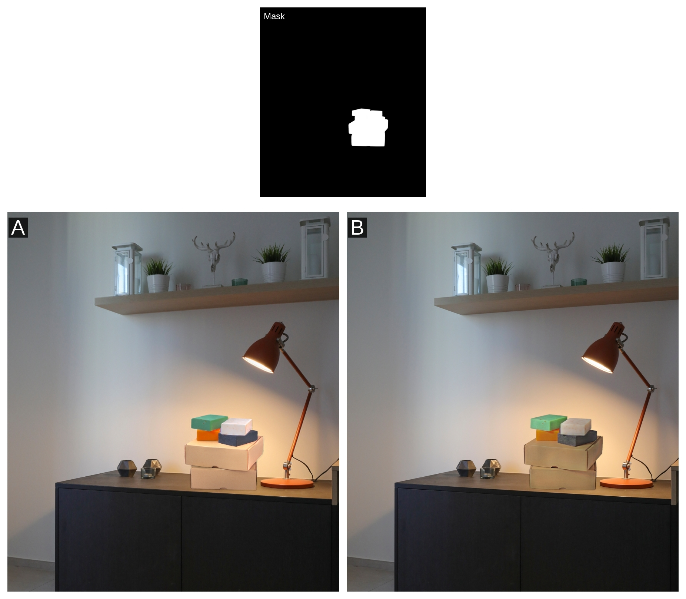

# Image Compositing Evaluation Survey

## Introduction:
Thank you for participating in our **Image Compositing** Evaluation Survey! We are conducting this survey to assess the quality of state of the art compositing methods. 

## Instructions:
In this survey, you will be presented with pairs of composited images along with a mask that highlights the composited region, such as the box in the example below. Your objective is to choose the image that, in your opinion, showcases superior compositing quality. Please take your time to carefully examine each image pair and determine which one has the foreground object better matching the background environment.

## Survey Completion:

Thank you once again for your participation. Let's begin the evaluation of image compositing quality!

<html>
<head>
    <title>Image Compositing Survey</title>
    
    
</head>
<body>
    <a class="my-button" onclick="redirectRandomLink()">Click Here to Start the Survey</a>
</body>
</html>

